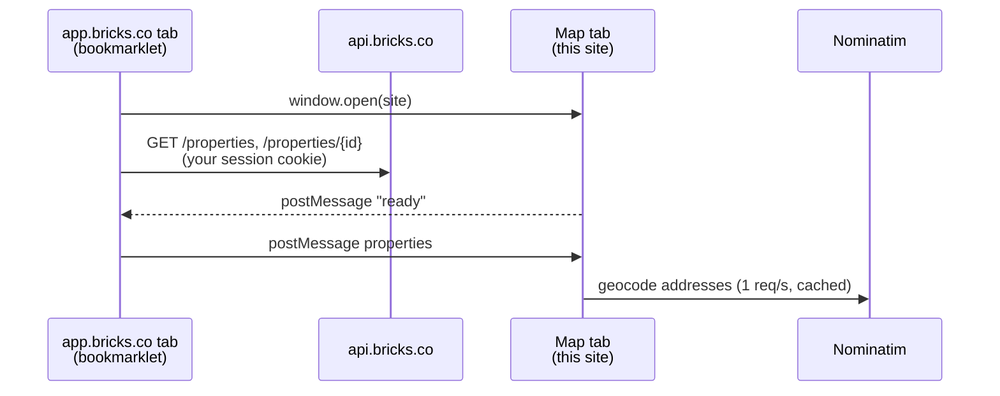

# Bricks properties

A map of the properties you own on [Bricks.co](https://www.bricks.co), built on OpenStreetMap.

**→ [lscchnh.github.io/bricks-properties](https://lscchnh.github.io/bricks-properties/)**

For each property you get:

- its location on the map, and a list of all your properties;
- a link to the property on Bricks.co;
- the return on investment and rental dividends;
- the number of bricks you own.

## How to use it

1. Open the [site](https://lscchnh.github.io/bricks-properties/) and drag the **📍 Bricks map** button to your bookmarks bar.
2. Log in to [app.bricks.co](https://app.bricks.co) as usual.
3. Click the **Bricks map** bookmark. The map opens in a new tab with your properties.

The last import is kept in your browser, so you can come back to the map later without
repeating these steps. Click the bookmark again on app.bricks.co to refresh it, or use
**Forget data** to erase it.

Not on Bricks.co yet? [Sign up here](https://app.bricks.co/sign-up/LOUCOC57) (referral link).

## How it works

The Bricks.co API only accepts requests coming from `app.bricks.co` (CORS), and is protected by
Cloudflare against non-browser clients, so neither this site nor a server can call it directly.
The bookmark works around this without ever handling your credentials:



- The bookmarklet ([`src/bridge/bookmarklet-source.js`](src/bridge/bookmarklet-source.js)) runs
  on app.bricks.co, reads the properties where you own bricks with your existing session, and
  posts them to the map tab. It only posts to this site's origin.
- The map ([`src/bridge/receiver.ts`](src/bridge/receiver.ts)) only accepts messages from
  `https://app.bricks.co` coming from the window that opened it.
- Addresses without coordinates are geocoded with
  [Nominatim](https://nominatim.org/release-docs/latest/api/Search/), following its usage policy
  (one request per second, results cached in `localStorage`).
- Nothing is sent to any server other than Bricks.co, Nominatim and the OpenStreetMap tile
  servers. The site is static and has no backend.

## Development

Requires Node.js 22 or later.

```sh
npm install
npm run dev        # dev server on http://localhost:5173/bricks-properties/
npm test           # unit tests (Vitest)
npm run lint       # ESLint
npm run build      # type-check and production build into dist/
npm run preview    # serve the production build on http://localhost:4173/bricks-properties/
```

The bookmark shown by the site always targets the site that generated it: when using the dev
server, drag the button from `localhost` to test your local changes against app.bricks.co.

Stack: Vue 3, TypeScript, Vite, [vue-leaflet](https://github.com/vue-leaflet/vue-leaflet), and
`vite-plugin-pwa` (the site can be installed as an app).

### Project layout

| Path                      | Role                                                  |
| ------------------------- | ----------------------------------------------------- |
| `src/bridge/`             | Bookmarklet source, link builder and message receiver |
| `src/lib/property.ts`     | Converts Bricks.co API objects into map properties    |
| `src/lib/geocode.ts`      | Nominatim geocoding with throttling and cache         |
| `src/lib/usePortfolio.ts` | App state: import, geocoding, saved snapshot          |
| `src/components/`         | Map, property list and setup instructions             |

### If Bricks.co changes its API

The API is undocumented. The bookmarklet reads `GET /properties?take=1000&cursor=0`, keeps the
entries with `investorBricks.owned > 0`, and merges in `GET /properties/{id}` for each of them.
Field parsing is deliberately tolerant (see `normalizeProperty`); adjust it and its tests in
`src/lib/__tests__/property.spec.ts` if the shape changes.

## Deployment

Every push to `main` runs lint, tests and build on GitHub Actions, then publishes `dist/` to the
`gh-pages` branch, which GitHub Pages serves. Nothing needs to be deployed by hand.
